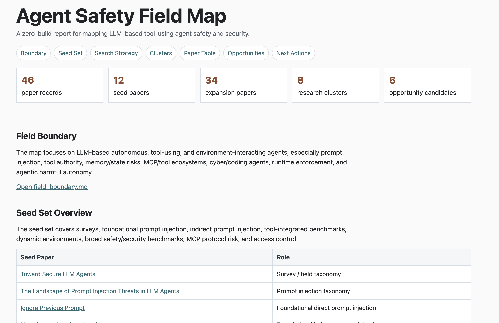
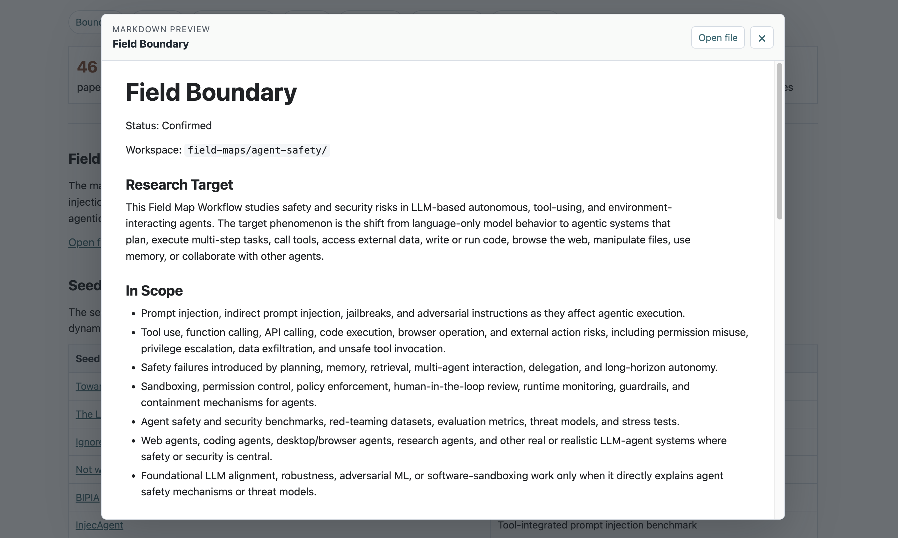
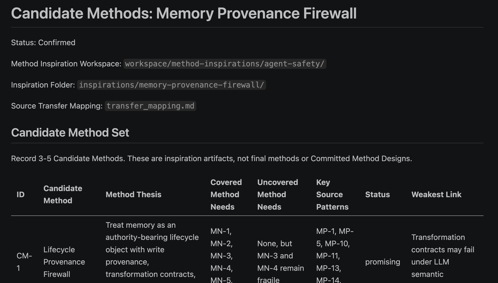
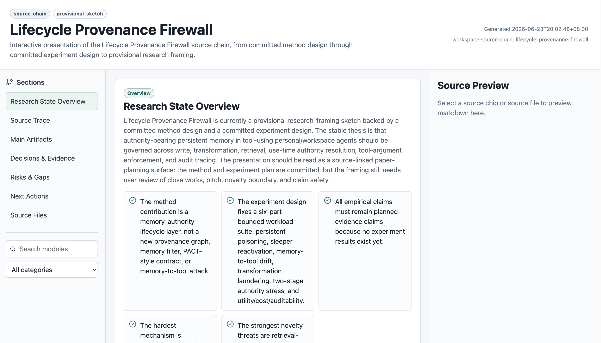
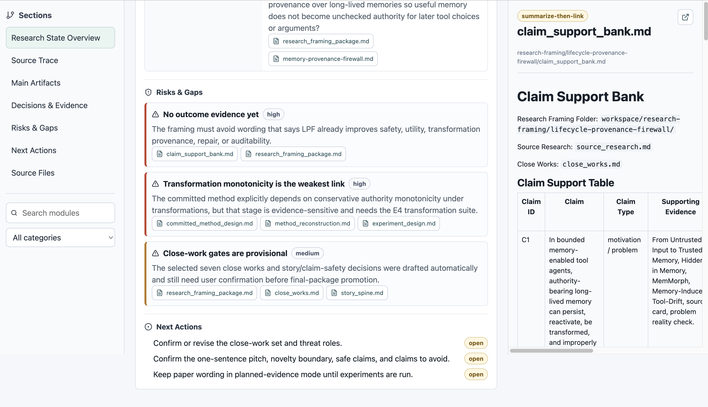

# Paper Reading Skills

语言：[English](README.md) | 简体中文

[](https://skills.sh/snake-fan/Paper-Reading-Skills)

> 一个强调阶段性确认与人机共创的 Codex skill 套件，把论文阅读转化为结构化、可追溯的研究决策。

Paper Reading Skills 是一组面向科研早期阶段的 Codex skills。它帮助研究者在不同研究阶段中，围绕明确的阅读动机组织论文阅读，并把阅读结果沉淀为可以继续推进研究的持久产物。

Paper Reading Skills 的核心是阶段性确认：Agent 会提出研究边界、论文集合、候选问题、方法需求、close works、claims、风险和下一步建议；研究者需要在关键节点确认、修改、拒绝，或明确委托之后，workflow 才继续向下推进。最终目标是让研究者真正理解这个项目，并能认领下一步研究决策。

在这个循环里，AI 负责扩展视野、结构化选项、挑战薄弱假设；研究者则在过程中学习项目、校准方向，并提供只有真正项目 owner 才能给出的判断。

高效论文阅读开始于先说清楚这些问题：

* 我为什么要读这些论文？
* 我现在要解决哪个研究决策？
* 我应该重点关注论文的哪些部分？
* 这次阅读最后应该产出什么？
* 读到什么程度就可以停止？

本项目把论文阅读拆成一组常见研究动作，并为每个动作设计对应的 workflow、输入边界、阅读策略、产出格式和停止条件。

---

## 核心想法

普通论文阅读通常以“读完论文”为目标，而本项目以“完成研究判断”为目标。

例如：

* 刚进入一个方向时，不应该急着总结论文，而应该先建立 field map。
* 有了初步 idea 时，不应该马上设计方法，而应该先做 problem reality check。
* 方法有雏形后，不应该让 AI 直接写成最终方案，而应该经过 method commitment。
* 准备写论文时，不应该泛泛找 related work，而应该围绕 close work、claim support 和 positioning 来组织表达。

因此，每个 skill 都对应一个具体研究阶段，并产出可以继续被下游 workflow 使用的 artifacts。

---

## 这个项目和 Auto Research 有什么不同

Paper Reading Skills 把研究看成一个协作式决策过程，而不是一次性内容生成任务。

* 阶段性 gate 会把关键选择显性化：field boundary、seed papers、method needs、candidate methods、experiment claims、close works 和最终 commitment 都要先被 review，才能继续影响下游 workflow。
* Agent 是主动的研究伙伴：它负责搜索、整理、比较、质疑和推荐，但不会把自己的推荐偷偷包装成研究者已经认领的结论。
* 研究者始终在过程里：研究者一边被 AI 启发，一边修正 AI 的 framing，并在文献证据不足以自动判断的地方提供自己的研究判断。
* 委托会被记录，而不是被伪装成确认。如果研究者要求更自动化的运行，未 review 的关键 gate 会让产物保持 provisional 状态。

这套 workflow 追求的是研究 ownership。一个阶段结束时，研究者应该能够讲清楚当前边界、证据、风险、备选路线和下一步，而不是只拿到一份自己仍然不熟悉的漂亮文档。

---

## Skill Map

| 阶段 | Skill | 它帮助回答的研究问题 | 主要产出 |
| ---- | ----- | -------------------- | -------- |
| 01 | Field Map | 这个领域有哪些主要分支、方法路线和研究机会？ | 领域图谱 / 研究簇 / 研究机会候选 |
| 02 | Research Question | 哪些 gap 可以变成可执行的研究问题？ | 研究问题卡片 |
| 03 | Problem Reality Check | 这个问题是真问题，还是只是看起来合理？ | 问题论证 / 风险记录 |
| 04 | Theoretical Grounding | 这个问题背后有没有可以支撑 framing 的理论依据？ | 理论 grounding 包 |
| 05 | Method Inspiration | 有哪些论文机制可以迁移成候选方法？ | 方法候选库 |
| 06 | Method Commitment | 当前方法是否足够稳定，能否被研究者认领？ | committed / provisional / redesign / rejected 方法结果 |
| 07 | Experiment Design | 如何把 claim 转化为可验证的实验设计？ | 实验计划 / baseline pressure matrix / claim-metric map |
| 08 | Research Framing | 如何把当前研究放入论文叙事和相关工作比较中？ | 研究 framing 包 |
| Extra | Workspace Presentation | 如何把已有研究 workspace 变成可浏览、可交接的界面？ | 交互式 presentation workspace |

---

## 产出方式

Paper Reading Skills 会根据任务规模和复盘需求，生成不同形态的研究产物。下面的截图重点展示三种产出方式：大任务领域调研、过程级文档记录，以及完整流程可视化。

### 大任务领域调研

<p>
  
  
</p>

面对“进入一个新方向”这类范围大、边界模糊的阅读任务，Field Map Workflow 会把分散论文整理成可视化 HTML 报告。它把 Field Boundary、Seed Set、Search Strategy、Research Clusters、Paper Table、Research Opportunity Candidates 和 Next Actions 放进一个可浏览界面。

这种方式的优势：

* 支持从浅入深：用户可以先看覆盖数量、clusters 和 opportunities，再逐步钻进源笔记；
* 把“大而散”的文献调研任务变成有边界、有路径的领域洞察过程；
* 以零构建静态 HTML 交付，轻量、可打开、可分享。

### 过程记录与决策追溯

<p>
  
</p>

各个 workflow 不只生成最终摘要，也会保留完整过程记录。上面的例子展示了方法阶段如何记录 source workspace、transfer mapping、Candidate Methods、Method Thesis、已覆盖和未覆盖的 Method Needs、source patterns、状态以及 weakest link。

这种方式的优势：

* 决策可追溯：后续读者能看到哪些选择被保留、推迟、拒绝，哪些地方仍然脆弱；
* 中间推理不会消失在聊天历史里，而是沉淀成可复查的文档；
* 阶段性确认记录会说明研究者在哪里同意、修改、委托或阻止了 agent 的建议；
* 下游 workflow 可以继承 source links、未解决风险和决策状态，不必猜测结果是怎么来的。

### 完整流程可视化

<p>
  
  
</p>

当研究链条已经比较完整时，Workspace Presentation skill 可以生成复杂的交互式 React/Vite 网页，把整体研究流程可视化。它可以把 method design、experiment design、research framing、risks、source trace、next actions 和 source-file previews 连接到同一个可导航 workspace 中。

这种方式的优势：

* 一眼看到整体研究状态，同时保留回到源 artifacts 的链接；
* 把多阶段研究过程变成适合交接、复读和项目 review 的网页界面；
* 让 decisions、evidence、risks 和 next actions 同时可见，而不是散落在多个文件夹里。

---

## Workflow

这些 skills 被设计成一条研究管线：

```text
Field Map
  |
  v
Research Question
  |
  v
Problem Reality Check
  |
  v
Theoretical Grounding
  |
  v
Method Inspiration
  |
  v
Method Commitment
  |
  v
Experiment Design
  |
  v
Research Framing
  |
  v
Workspace Presentation
```

这条管线并不是严格线性的。用户可以根据当前研究状态，从任意阶段开始。

例如：

* 如果用户刚进入一个领域，可以从 `skills/01-field-map` 开始。
* 如果用户已经有一个 idea，但不确定它是否成立，可以从 `skills/03-problem-reality-check` 开始。
* 如果用户有多个候选方法，可以从 `skills/06-method-commitment` 开始。
* 如果用户已经有稳定方法，并希望设计实验，可以从 `skills/07-experiment-design` 开始。

---

## 使用示例

### 1. 进入一个新的研究方向

用户目标：

> I want to understand LLM agent evaluation, but I do not know the main branches yet.

推荐 skill：

```text
skills/01-field-map
```

预期产出：

* field boundary
* seed paper set
* paper position records
* research clusters
* opportunity candidates
* static HTML field report

---

### 2. 把模糊 gap 转化为研究问题

用户目标：

> I found several gaps in related work, but I do not know which one is worth pursuing.

推荐 skill：

```text
skills/02-research-question
```

预期产出：

* candidate research questions
* motivation notes
* feasibility risks
* evidence requirements
* recommended next step

---

### 3. 压力测试一个研究 idea

用户目标：

> I have an idea, but I am worried the problem may already be solved or not important enough.

推荐 skill：

```text
skills/03-problem-reality-check
```

预期产出：

* problem existence check
* evidence support
* prior-solution risk
* motivation safety notes
* recommended reframing or stop condition

---

### 4. 收敛到一个方法

用户目标：

> I have several candidate methods and want to decide what my final method should be.

推荐 skill：

```text
skills/06-method-commitment
```

预期产出：

* source method
* method reconstruction
* challenge questions
* decision log
* method commitment status
* downstream routing suggestion

---

## 如何使用

通过 open skills CLI 直接安装：

```bash
npx skills@latest add snake-fan/Paper-Reading-Skills
```

安装前预览可用 skills：

```bash
npx skills@latest add snake-fan/Paper-Reading-Skills --list
```

如果想把全部 skills 安装到 Codex 的全局 skills 目录：

```bash
npx skills@latest add snake-fan/Paper-Reading-Skills --skill '*' -g -a codex
```

本仓库同时提供 `.claude-plugin/plugin.json`，兼容 Claude Code plugin manifest 生态的安装器可以显式发现同一组 skills。

### 手动设置

克隆仓库：

```bash
git clone https://github.com/snake-fan/Paper-Reading-Skills.git
cd Paper-Reading-Skills
```

每个 skill 都位于 `skills/` 目录下：

```text
skills/
├── 01-field-map/
├── 02-research-question/
├── 03-problem-reality-check/
├── 04-theoretical-grounding/
├── 05-method-inspiration/
├── 06-method-commitment/
├── 07-experiment-design/
├── 08-research-framing/
└── workspace-presentation/
```

使用 skill 之前，先判断当前研究状态：

```text
I am currently trying to:
- understand a field
- find a research question
- verify whether a problem is real
- find theoretical support
- get method inspiration
- commit to a method
- design experiments
- frame the paper
```

然后在 Codex 中调用对应 skill。

示例 prompt：

```text
Use the field-map skill to help me map the research field of memory safety in LLM agents.
I want to identify major branches, representative papers, evaluation settings, saturated areas, and possible research opportunities.
```

---

## 产出理念

每个 skill 都旨在产出持久的研究 artifacts，而不是临时聊天总结。

这些产出应该是：

* 可追溯：重要 claims 应该能连接回论文或上游 artifacts。
* 面向决策：每个 artifact 都应该帮助用户完成一个研究判断。
* 参与式：重要 workflow gate 应该邀请研究者确认、修改、拒绝，或明确委托下一步。
* 可复用：下游 skills 应该能够消费上游产出。
* 有边界：每个 workflow 都应该有清晰的停止条件。
* 诚实面对不确定性：薄弱证据、未解决风险和不安全 claims 都应该被明确记录。

---

## 设计原则

### 1. 动机优先的阅读

本项目假设论文阅读应该从用户当前的研究动机开始，而不是从通用总结模板开始。

### 2. Artifact 驱动的 workflow

每个 skill 都会写出结构化 artifacts，避免研究进展消失在聊天历史中。

### 3. 人类拥有关键决策

Agent 可以提出、组织、质疑和总结，但重要的研究承诺应该始终对用户可见，并由研究者认领。Agent 的推荐不会自动变成 commitment，只有经过相关 gate 的确认或明确委托，才会进入下游。

### 4. 下游路由纪律

不是所有产出都应该进入下游。例如，薄弱问题不应该自动进入方法设计，provisional method 也不应该被当成 experiment-ready method。

### 5. 证据敏感的 framing

本项目避免把弱证据包装成强 claim。它会记录哪些内容可以安全表达，哪些还需要更多支持，以及哪些说法应该避免。

---

## 仓库结构

```text
.
├── assets/
│   ├── candidate_method.png
│   ├── fieldmap1.png
│   ├── fieldmap2.png
│   ├── final_presentation1.png
│   └── final_presentation2.png
├── .claude-plugin/
│   └── plugin.json
├── README.md
├── README.zh-CN.md
└── skills/
    ├── 01-field-map/
    │   └── SKILL.md
    ├── 02-research-question/
    │   └── SKILL.md
    ├── 03-problem-reality-check/
    │   └── SKILL.md
    ├── 04-theoretical-grounding/
    │   └── SKILL.md
    ├── 05-method-inspiration/
    │   └── SKILL.md
    ├── 06-method-commitment/
    │   └── SKILL.md
    ├── 07-experiment-design/
    │   └── SKILL.md
    ├── 08-research-framing/
    │   └── SKILL.md
    └── workspace-presentation/
        ├── SKILL.md
        ├── references/
        └── templates/
```

---

## 当前状态

已完成：

* core skill structure
* field map workflow
* research question workflow
* problem reality check workflow
* theoretical grounding workflow
* method inspiration workflow
* method commitment workflow
* experiment design workflow
* research framing workflow
* workspace presentation workflow

进行中：

* improving cross-skill artifact compatibility
* refining workflow gates and status routing
* adding more example workspaces
* improving presentation templates
