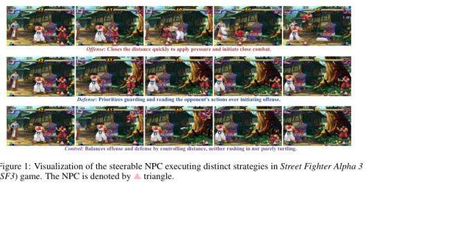

# ReactiveGWM: Steering NPC in Reactive Game World Models

Resource: user-provided local PDF; https://inv-wzq.github.io/ReactiveGWM/; arXiv:2605.15256

Year: 2026

Venue: arXiv preprint

Source Verified: Yes

Discovery Source: User-provided

## Research Problem

Existing game world models condition mainly on the player's action stream and absorb NPCs into background dynamics. How can a world model represent NPCs as autonomous, strategically steerable participants while retaining player control?

## Field Position

Defines the reactive/NPC-centric branch of game world models. It moves beyond player-centric visual rendering by explicitly separating player action control from high-level NPC strategy.

## Assumption

NPC tactical intent can be represented through a compact strategy prompt, while game-specific appearance and physics remain largely in the frozen or reused diffusion backbone.

## Method

- Construct synchronized video-player-action-NPC-prompt triplets from SF2 and SF3.
- Inject player actions as a lightweight additive bias in DiT blocks.
- Ground NPC strategy prompts (Offense, Control, Defense) through cross-attention modules.
- Transfer the learned cross-attention behavior modules into an off-the-shelf world model of another game without domain-specific strategy retraining.

## Input/Output

Input: initial frame, frame-level player actions, and an NPC-specific strategy prompt.

Output: future gameplay video with fine-grained player control and strategy-aligned NPC behavior.

## Evaluation

- Player action following: movement and attack accuracy.
- NPC strategy following: VLM referees and human classification.
- Visual quality: SSIM and LPIPS.
- Transfer: base versus zero-shot transferred modules across SF2/SF3.
- Human study with 19 participants.

## Paper Visual Evidence

> **Paper Visual Evidence - Figure 1**: Source: *ReactiveGWM*, PDF p. 1 / Figure 1. Use: shows that one model is intended to produce visibly distinct Offense, Defense, and Control behaviors. Capture: cropped from the user-provided PDF with labels and caption retained.

## Contribution Type

- model
- dataset
- method
- system

## Limitation

- Evaluation is limited to two closely related 2D fighting games.
- Strategy space has only three coarse classes.
- Strategy annotation depends on VLM-assisted behavioral labeling and deterministic rules.
- Zero-shot Control transfer is weaker because ranged attacks are game-specific.
- The model does not explicitly represent health, meters, timers, collision state, or other mechanics.

## Primary Research Cluster

Autonomous NPC and Multi-Agent Interaction

## Secondary Research Clusters

- Structured State and Mechanics Consistency
- Transfer and Generalization
- Evaluation and Benchmarking

## Similar Works

- [StatePlay](2026-stateplay.md)
- [GameNGen](2024-diffusion-models-are-real-time-game-engines.md)

## Contrasting Works

- [Matrix-Game 3.0](2026-matrix-game-3.md)
- [DreamerV3](2024-mastering-diverse-domains-through-world-models.md)

## Gap Left

Fine-grained compositional NPC goals, multi-NPC coordination, explicit game state/rule modeling, broader genres, causal evaluation, and transfer across substantially different mechanics.

## Notes

The cross-attention energy remains low while its signal direction changes, supporting the interpretation that the transferred module acts as a small but behaviorally meaningful control channel.

